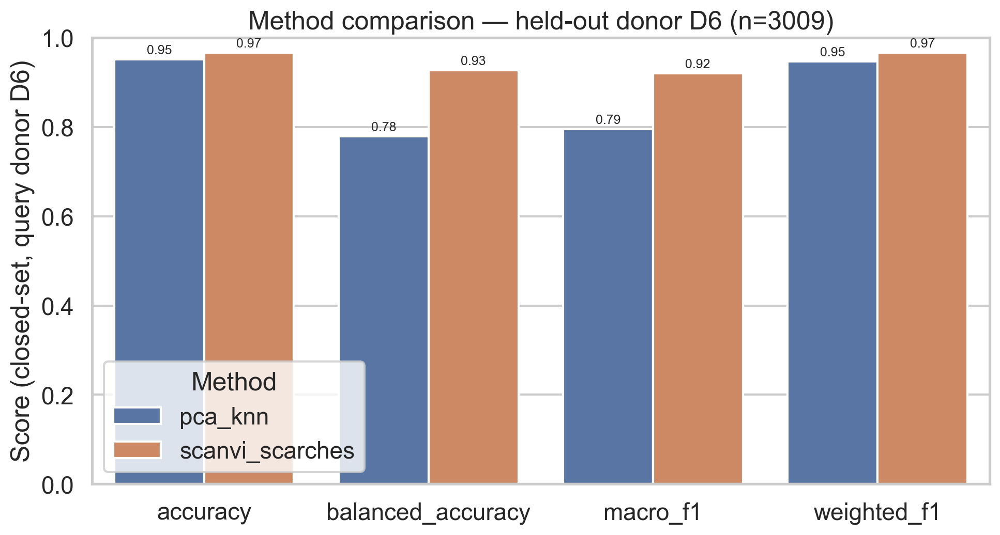
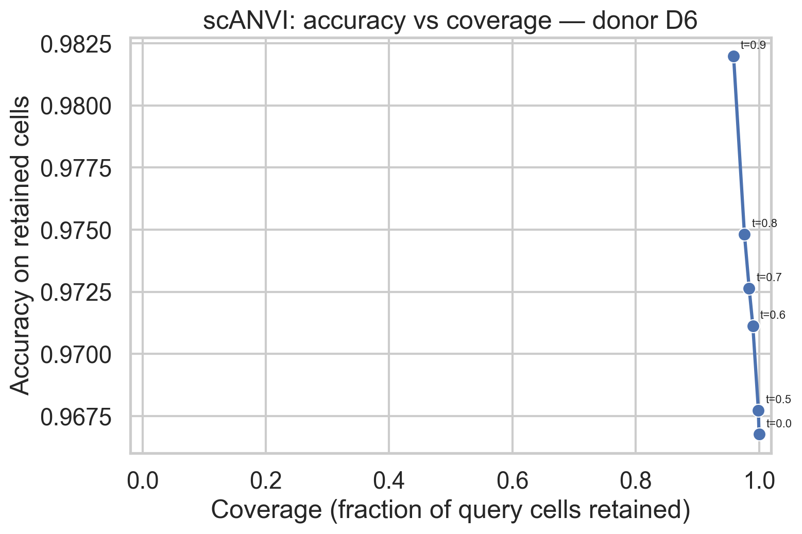
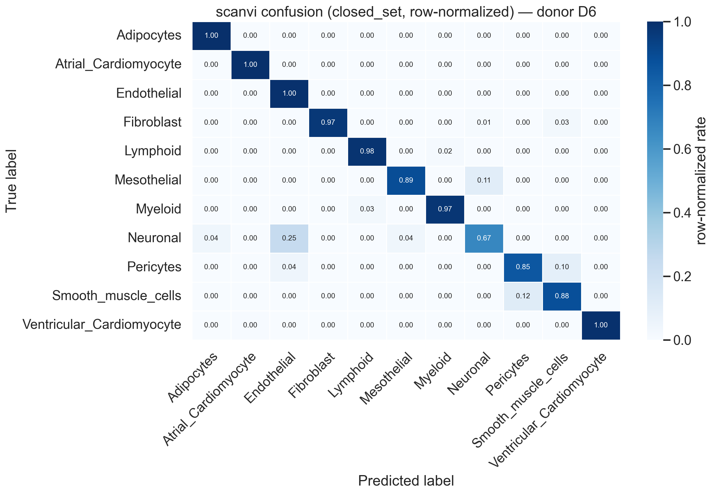
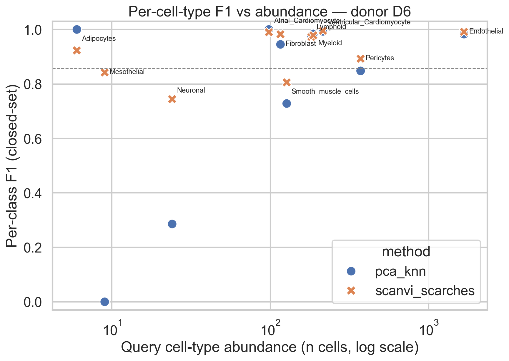

# Donor-held-out reference mapping of the Human Heart Cell Atlas with scVI, scANVI, and scArches

**Status: MAIN_RESULTS_VERIFIED** — tracked predictions, metrics, and figures
pass public-artifact verification (`--verify-published-results`). Full
local-run verification (`--require-complete-local-run`) additionally requires
the git-ignored model and h5ad artifacts, which are regenerated by running the
pipeline locally (see [§19](#19-local-execution)). Smoke artifacts exist only
for code-path testing and never count as a main run.

This project reproduces and adapts the scArches/scANVI reference-mapping
workflow to a donor-held-out Human Heart Cell Atlas case study. One complete
heart donor is held out as an entirely unseen query; scVI and scANVI are
trained on the other donors; the scArches query update maps the held-out
donor into the reference latent space; and the query's true labels are opened
only after predictions are frozen. A PCA + kNN baseline and a
confidence–coverage analysis accompany the deep models.

## 1. One-paragraph summary

Using the 20k-cell subsampled Human Heart Cell Atlas shipped with
scvi-tools (18,641 quality-controlled cells, 14 donors), donor **D6**
(3,009 cells, all 11 broad cell types) was fixed as the query by a
pre-registered, deterministic rule before any training. The remaining 13
donors (15,632 cells) formed the reference. Labels were sealed, 2,000 HVGs
and every learned transform were fit on reference cells only, and scANVI
predictions were compared with a PCA+kNN baseline using accuracy, balanced
accuracy, macro-/weighted-F1, per-class metrics, confusion matrices and a
confidence-threshold sweep. This is a single-donor case study, not a paper
reproduction and not evidence of generalisation to all humans.

## 2. Scientific question

> Can scANVI/scArches accurately transfer cardiac cell-type labels to a donor
> that was completely unseen during reference training, and can prediction
> confidence identify unreliable cross-donor annotations?

## 3. Why donor-held-out evaluation matters

Cells from the same donor share biology, dissection, dissociation and
library-preparation effects. A random cell-level split leaks that shared
structure between train and test and inflates apparent performance. The
meaningful generalisation question for atlas mapping is: *given a brand-new
donor, can the reference annotate them?* Holding out a complete donor makes
the evaluation match that question.

## 4. Dataset

`scvi.data.heart_cell_atlas_subsampled(remove_nuisance_clusters=True)`
(scvi-tools 1.3.3): 18,641 cells × 26,662 genes after doublet/NotAssigned
removal, 14 donors (`D1–D7, D11, H2–H7`), 11 author-annotated broad cell
types. Audited facts (`docs/DATA_DICTIONARY.md`, `results/data_audit.json`):
`adata.X` is CSR float32 **raw integer UMI counts**; no `.raw` and no count
layers on download. The pipeline copies `X` to `layers["counts"]`, which is
the only count input to the models. The 65-state `cell_states` column is
future work and is removed from query inputs.

## 5. scVI, scANVI and scArches in plain language

- **scVI** — a variational autoencoder for raw counts that learns a
  donor-conditioned 30-dimensional representation with a ZINB decoder; no
  labels used.
- **scANVI** — adds a semi-supervised cell-type classifier on top of the scVI
  latent space, so the representation directly supports label transfer.
- **scArches** — "surgery" that attaches new batch parameters for the query
  donor while freezing the trained reference network; the query is mapped
  *into* the reference space instead of being used to retrain it. In
  scvi-tools this is `SCANVI.prepare_query_anndata` + `load_query_data` + a
  short `weight_decay=0.0` update.

## 6. Experimental design

1. Audit data; fix keys (`donor`, `donor`, `cell_type`, layer `counts`).
2. Deterministic query selection: label-blind rule — the donor with the
   most cells, lexicographic tie-break → **D6**. `cell_type` is never read
   during selection. Split at donor granularity.
3. Seal D6 truth into `data/splits/query_eval_labels_main.csv`; the model
   input query contains only `Unknown` labels and no label-like columns.
4. Select 2,000 batch-aware seurat_v3 HVGs on the reference only.
5. Train PCA+kNN baseline; train scVI → scANVI; run the scArches query
   update; freeze both prediction files.
6. Only then evaluate against the sealed labels; generate figures; verify.

## 7. Leakage prevention

Donor/cell-ID disjointness, sealed labels, reference-only HVG/PCA/kNN
fitting, raw-count input validation, label-blind donor selection, and static
enforcement that training scripts can neither import evaluation code nor read
the sealed file (training scripts use `load_model_split`, which never touches
the sealed CSV; only `evaluate.py` uses `load_split`). Full list:
[`docs/LEAKAGE_CHECKLIST.md`](docs/LEAKAGE_CHECKLIST.md). Tests assert all of
this; `scripts/verify_outputs.py` re-checks artifacts on disk.

## 8. PCA + kNN baseline

Same reference HVGs → per-cell library-size normalisation (10k) + log1p →
PCA (30 components, fit on reference) → distance-weighted kNN (k = 15) fit on
reference labels → vote-fraction confidence. One-time densification of the
15,632 × 2,000 HVG matrix (~0.125 GB) is recorded in
`results/training/baseline_summary_main.json`.

## 9. Reference-model training

scArches-compatible architecture from the current official tutorial:
`n_latent=30, n_hidden=128, n_layers=2, dropout=0.2, use_layer_norm="both",
use_batch_norm="none", encode_covariates=True`, ZINB. scVI up to 400 epochs
(early stopping, patience 20); scANVI initialised from scVI weights, up to
20 epochs, `n_samples_per_label=100`. Seed 42; CPU locally, T4 via Colab.

## 10. Query mapping

Reference genes applied to D6 (zero-padded via `prepare_query_anndata`),
frozen reference weights, up to 100 update epochs, `weight_decay=0.0`.
Confidence = max soft score; entropy is stored. Trainable vs total
parameters are recorded (reference weights stay frozen).

## 11. Evaluation metrics

Accuracy, balanced accuracy, macro-F1, weighted-F1; per-class
precision/recall/F1/support; raw and row-normalised confusion matrices.
Always two scopes: **all** query cells and **closed_set** cells;
out-of-reference types are counted separately (D6 happens to contain none —
all 11 types occur in the reference). Rare types are never deleted; a
pre-registered secondary macro-F1 covers types with ≥ 20 query cells while
the all-class macro-F1 is always reported (Mesothelial, n = 9, stays
everywhere else). Definitions: [`docs/METRICS.md`](docs/METRICS.md).

## 12. Confidence-aware abstention

Thresholds t ∈ {0, 0.5, 0.6, 0.7, 0.8, 0.9}: retain cells with confidence ≥
t and report coverage, retained accuracy/balanced-accuracy/macro-F1/error
rate and the true-type composition of rejected cells. Coverage is 1 at
t = 0 and never increases with t. Confidence is a **prediction confidence
score**, not a calibrated probability. If rare types are disproportionately
rejected, that is a coverage caveat for this donor.

## 13. Core figures

(Generated for the main run in `figures/`; smoke figures stay in
`figures/smoke/` and are never used as evidence.)

- `umap_raw_by_donor.png`, `umap_scanvi_by_donor.png` — diagnostic mixing
  (visual only; the joint UMAP is fit on `X_scANVI`, seed 42);
- `confusion_scanvi_normalized.png`;
- `method_comparison.png` (both methods);
- `f1_vs_cell_abundance.png` (one point per cell type);
- `coverage_accuracy.png`.

## 14. Results

Real output of the CPU main run (seed 42; scVI 316 epochs after early
stopping in ≈ 20.0 min, scANVI 11 epochs in ≈ 1.5 min, scArches update 76
epochs in ≈ 1.2 min; 578,946 of 1,426,188 query-model parameters trainable).
Full numbers: `results/metrics/` and
[`results/analysis_summary.md`](results/analysis_summary.md).

D6 contains no out-of-reference cell types (all 11 types occur in the 13
reference donors), so the `all` and `closed_set` scopes are identical here.

| method | scope | accuracy | balanced acc. | macro-F1 | weighted-F1 |
|---|---|---|---|---|---|
| pca_knn | all | 0.952 | 0.779 | 0.795 | 0.947 |
| scanvi_scarches | all | **0.967** | **0.927** | **0.920** | **0.967** |

Both methods annotate abundant populations well; scANVI/scArches adds the
most on balanced accuracy (+0.148) and macro-F1 (+0.125), i.e. on the rare
types where the simple linear baseline struggles. This is evidence about
**cells of one held-out donor**, not generalisation across donors.



### Confidence–coverage

Raising the confidence threshold trades coverage for retained accuracy, for
both methods:

| threshold | pca_knn coverage / acc. | scANVI coverage / acc. |
|---|---|---|
| 0.0 | 1.000 / 0.952 | 1.000 / 0.967 |
| 0.5 | 0.996 / 0.955 | 0.999 / 0.968 |
| 0.7 | 0.959 / 0.971 | 0.984 / 0.973 |
| 0.9 | 0.892 / 0.984 | 0.959 / 0.982 |

scANVI keeps more cells at every threshold while reaching similar top
retained accuracy. Coverage is 1 at t = 0 and non-increasing by
construction. Confidence is not calibrated; high-confidence errors should be
inspected rather than assumed absent.



## 15. Per-cell-type failure analysis

Weakest scANVI classes (D6 supports in parentheses): Neuronal (24; F1 0.74,
recall 0.67; 25% of neuronal cells are predicted as Endothelial),
Smooth_muscle_cells (127; F1 0.81; 12% predicted as Pericytes),
Mesothelial (9; F1 0.84, recall 0.89; 11% predicted as Myeloid) and
Pericytes (372; F1 0.89; 10% predicted as Smooth muscle). The baseline
completely misses Mesothelial (recall 0) and mostly misses Neuronal (recall
0.17) — the generative model's main gains on this donor. Mesothelial (n = 9)
is below the pre-registered evaluable threshold (20) and is excluded only
from the evaluable macro-F1 aggregate; it is retained in the per-class table
and the all-class macro-F1.




## 16. Limitations

One held-out donor is one case study — 3,009 cells from D6 are not 3,009
independent replicates, and nothing here demonstrates generalisation to all
humans. Confidence scores are not calibrated. UMAP mixing is not proof of
biological correctness. High overall accuracy can coexist with poor rare-type
recall. Broad types, not fine states, are analysed. Generalisable claims would
need multiple pre-registered held-out donors (future work in
[`docs/scientific_notes.md`](docs/scientific_notes.md)).

## 17. Repository structure

```text
configs/        main.yaml / smoke.yaml (all parameters)
src/heartmap/   library: data, split, baseline, models, metrics,
                confidence, plotting, provenance, config
scripts/        9 CLI stages (audit → split → baseline → train → map →
                evaluate → figures → verify)
notebooks/      00–04 walkthrough notebooks + heart_mapping_colab.ipynb
tests/          38 CPU tests incl. leakage guards and a synthetic end-to-end run
data/           raw (ignored), processed h5ad (ignored), splits + sealed labels
models/         scvi/scanvi reference and query weights (ignored)
results/        predictions, metrics, training summaries, audits
figures/        main figures; smoke/ subdirectory for code-path checks
docs/           METHOD, RUNBOOK, COLAB_RUNBOOK, METRICS, checklists, ...
```

## 18. Installation

```bash
python3.10 -m venv .venv && source .venv/bin/activate
pip install -r requirements.txt          # exact tested set: requirements-lock.txt
pip install -e .
```

## 19. Local execution

Step-by-step commands are in [`docs/RUNBOOK.md`](docs/RUNBOOK.md). Short form:

```bash
python scripts/check_environment.py
python scripts/audit_data.py     --config configs/main.yaml
python scripts/prepare_split.py  --config configs/main.yaml
python scripts/run_baseline.py   --config configs/main.yaml
python scripts/train_reference.py --config configs/main.yaml   # CPU: tens of min
python scripts/map_query.py      --config configs/main.yaml
python scripts/evaluate.py       --config configs/main.yaml    # opens sealed labels
python scripts/make_figures.py   --config configs/main.yaml
python scripts/verify_outputs.py --config configs/main.yaml --verify-published-results
# To additionally verify local (git-ignored) model and h5ad artifacts:
python scripts/verify_outputs.py --config configs/main.yaml --require-complete-local-run
```

## 20. Google Colab execution

Open `notebooks/heart_mapping_colab.ipynb` in Colab on a T4 runtime, set
`REPO_URL` to your fork, run top to bottom; the final cells run evaluation,
verification and package a downloadable zip. Step-by-step guidance
(including CUDA OOM and merging results back):
[`docs/COLAB_RUNBOOK.md`](docs/COLAB_RUNBOOK.md).

## 21. Reproducibility and provenance

Fixed seed (42), deterministic label-blind query rule, YAML-driven
parameters, SHA-256 hashes of reference/query cell IDs, per-run metadata
with package versions, device, epochs completed, early-stop status and
timings, and a tracked artifact manifest (`results/artifact_manifest.json`)
recording SHA-256 of config, HVG list, prediction CSVs, sealed labels, and
git commit:
[`docs/provenance.md`](docs/provenance.md). Large h5ad/model artifacts are
git-ignored; committed artifacts are code, configs, tests, docs, manifests,
small CSVs and figures.

## 22. What I learned

- The honest experimental unit for cross-donor label transfer is the donor,
  not the cell; sealing labels structurally (separate file + column removal
  + static import guards) makes leakage failures loud instead of possible.
- scvi-tools 1.3/1.4 API details (loader signature, tutorial path) drift;
  verifying against the installed package beats copying remembered
  notebooks.
- A trivial baseline on the same HVGs is a meaningful benchmark — the
  generative model has to earn its complexity.
- Confidence abstention is a coverage trade-off, and its fairness depends on
  which populations get rejected.

## 23. Open questions

- Does the ranking of methods hold across many independently held-out donors?
- Are confidence scores calibrated, and can calibration be performed without
  touching the evaluated donor?
- How far does the same protocol transfer to the 65 fine cell states?
- How should types genuinely absent from a reference be detected (D6
  contains none, so this protocol does not test novelty discovery)?

## 24. References

- Lotfollahi M. et al. *Mapping single-cell data to reference atlases by
  transfer learning.* Nat Biotechnol (2022).
  [doi:10.1038/s41587-021-01001-7](https://doi.org/10.1038/s41587-021-01001-7)
- Xu C. et al. *Probabilistic harmonization and annotation of single-cell
  transcriptomics data with deep generative models.* Mol Syst Biol (2021).
  [doi:10.15252/msb.20209620](https://doi.org/10.15252/msb.20209620)
- [scvi-tools reference mapping tutorial (1.3.x)](https://docs.scvi-tools.org/en/1.3.x/user_guide/notebooks/multimodal/scarches_scvi_tools.html)
- [Human Heart Cell Atlas](https://www.heartcellatlas.org/)
- Lopez R. et al. (scVI), Gayoso A. et al. (scvi-tools).

## 25. License

[MIT](LICENSE). See [CITATION.cff](CITATION.cff) for attribution; please cite
the underlying method and dataset papers together with this workflow
repository.
